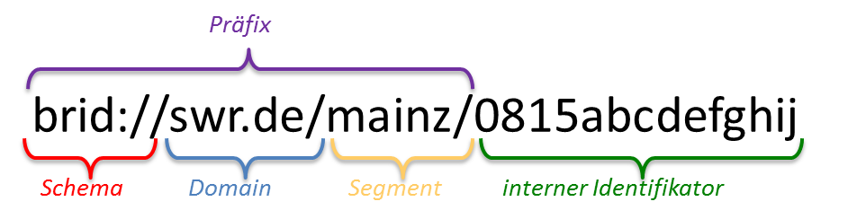

# BRID-Generator
A simple node.js-Service to generate BRIDs (**BR**oadcast-**ID**) for the [BMF](http://bmf.irt.de/ "BMF")-datamodel of IRT.

## Formatdefinition für die eindeutige ID

**brid://[domain]/[segment]/[internalid]**

* Präfix		: Erweiterung für weltweite Eindeutigkeit
* Schema		: Verwendung für Metadatenobjekte (z.B. Sendungsbeschreibung)
* Domain		: Organisationseinheit bzw. Rundfunkanstalt
* Segment		: Präzisierung der Domain (mehrfach möglich)
* int. Identifier	: eindeutige ID eines Metadatenobjektes im Präfix-Umfeld

## v2
* to get a BRID, post some metadata to /v2/brid
  * title
  * segment
  * domain
  * author
  * ...
* have a little "database"
  * jsonfile
  * array with objects
    * brid
    * metadata
* on brid post
  * check database if our metadata are already there
  * then send the brid or create a new one to save in the database

## production release
* interchangable database
* tests
* docs
* package-scripts for generation